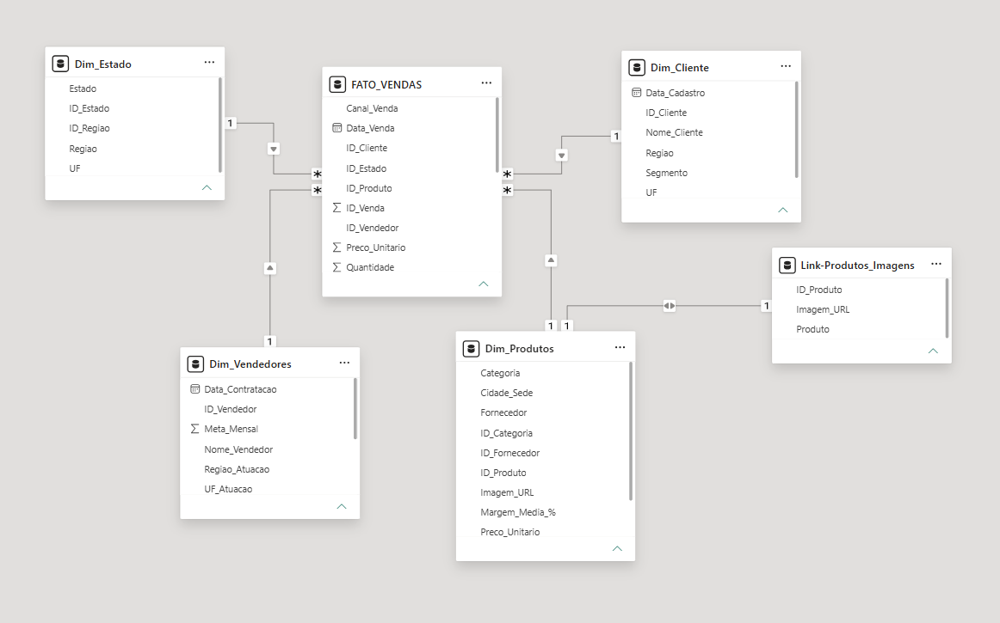
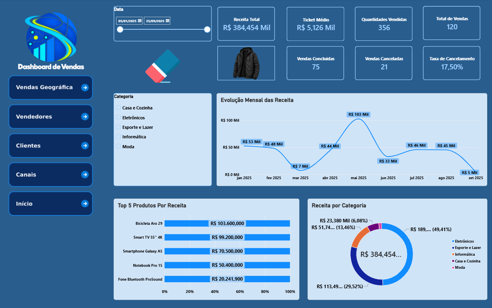
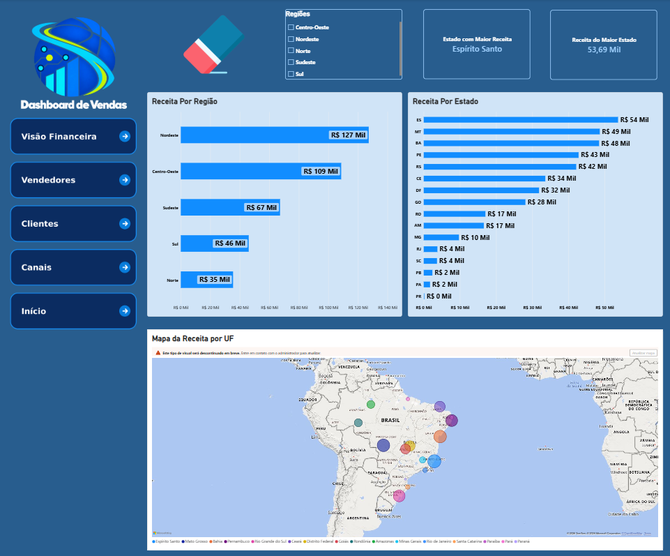
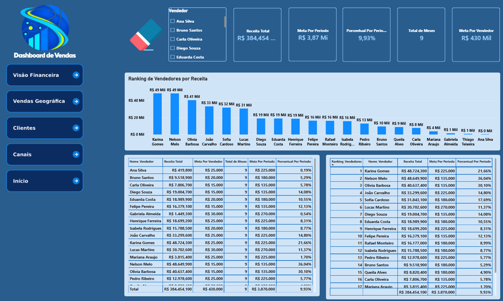
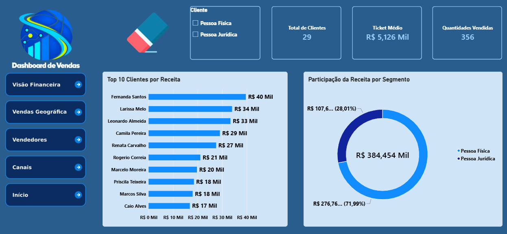
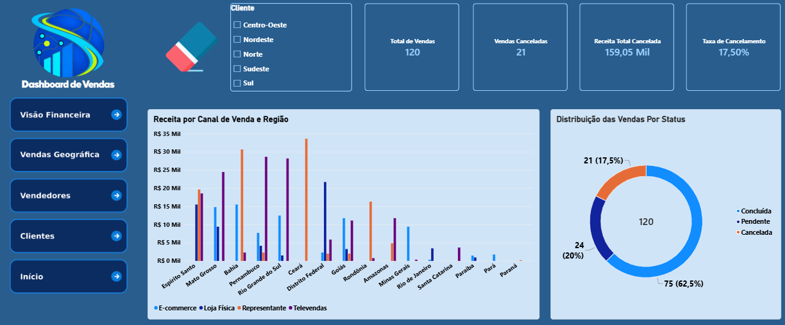

# 📊 Dashboard Analítico de Vendas — Power BI

Projeto de Business Intelligence desenvolvido em **Power BI** a partir de uma base simulada de vendas, com foco em transformação de dados, modelagem dimensional, criação de indicadores e análise de negócio.

## 🎯 Objetivo

Construir um dashboard analítico capaz de apoiar a análise do desempenho comercial por:

- Produtos
- Clientes
- Vendedores
- Estados e regiões
- Canais de venda
- Status das vendas

---

## 🛠️ Tecnologias utilizadas

- Power BI
- Power Query
- DAX
- Excel
- Modelagem Dimensional
- Star Schema

---

## 🔄 Processo de desenvolvimento

### 1. Ingestão

A base original foi disponibilizada em Excel contendo dados de:

- Vendas
- Produtos
- Categorias
- Fornecedores
- Clientes
- Vendedores
- Estados
- Regiões

### 2. Tratamento dos Dados

Os dados foram preparados no **Power Query**, utilizando uma camada de staging para preservar as fontes originais e organizar o processo de transformação.

Principais tratamentos realizados:

- Ajuste de tipos de dados
- Padronização das informações
- Tratamento das tabelas auxiliares
- Mesclagem de estados e regiões
- Integração de categorias e fornecedores
- Preparação das tabelas fato e dimensão

### 3. Modelagem Dimensional

Foi implementado um modelo dimensional no formato **Star Schema**, tendo a tabela `FATO_VENDAS` como tabela central.

Principais dimensões:

- `Dim_Cliente`
- `Dim_Vendedores`
- `Dim_Produtos`
- `Dim_Estado`

As relações foram configuradas no padrão **1:N**, com propagação de filtro das dimensões para a tabela fato.

---

## ⭐ Modelo de Dados

---
## 📐 Principais Métricas DAX

Entre as principais métricas desenvolvidas estão:

- Receita Total
- Quantidade Vendida
- Vendas Concluídas
- Ticket Médio
- Total de Vendas
- Vendas Canceladas
- Taxa de Cancelamento
- Receita Cancelada
- Receita Pendente
- Meta por Vendedor
- Meta do Período
- Percentual de Atingimento
- Ranking de Vendedores
- Total de Clientes

Todas as medidas podem ser consultadas em:

👉 [Medidas DAX do Projeto](dax/medidas-dax.md)

---

## 📊 Estrutura do Dashboard

O dashboard foi dividido em cinco áreas analíticas.

### 1. Visão Executiva

Apresenta os principais KPIs do negócio e uma visão consolidada do desempenho comercial.

### 2. Análise Geográfica

Permite analisar o desempenho das vendas por região e estado.

### 3. Vendedores

Apresenta o ranking dos vendedores, receita gerada, metas comerciais e percentual de atingimento.

### 4. Clientes

Analisa o perfil dos clientes, participação entre Pessoa Física e Pessoa Jurídica e os principais clientes por receita.

### 5. Status e Canais

Apresenta a distribuição das vendas por status e o desempenho dos diferentes canais comerciais.

---

## 📈 Principais Indicadores

| Indicador | Resultado |
|---|---:|
| Receita Total Concluída | R$ 384.454,10 |
| Ticket Médio | R$ 5.126,05 |
| Quantidade Vendida | 356 |
| Total de Vendas | 120 |
| Vendas Concluídas | 75 |
| Vendas Pendentes | 24 |
| Vendas Canceladas | 21 |
| Taxa de Cancelamento | 17,50% |
| Período analisado | Jan/2025 a Set/2025 |
| Meses considerados | 9 |
| Meta acumulada do período | R$ 3.870.000,00 |
| Atingimento consolidado da meta | 9,93% |

---

## 💡 Insights Identificados

A análise demonstrou uma receita concluída de aproximadamente **R$ 384,5 mil**, com ticket médio superior a **R$ 5,1 mil**.

Das 120 vendas registradas:

- **62,5% foram concluídas**
- **20% permaneceram pendentes**
- **17,5% foram canceladas**

As vendas pendentes e canceladas representam um volume financeiro relevante que pode ser analisado para identificação de oportunidades comerciais e possíveis causas de perda de receita.

Também foi identificada uma forte concentração da receita em poucos produtos, com os cinco principais produtos representando aproximadamente **89,5% da receita concluída**.

O mês de maio apresentou destaque no período, concentrando aproximadamente **26,7% da receita concluída**.

Esses resultados devem ser interpretados no contexto deste projeto, que utiliza uma **base de dados simulada**.

---

## 📁 Arquivos do Projeto

- [📊 Baixar Dashboard Power BI (.pbix)](dashboard/Power_bi_Vendas.pbix)
- [📂 Base de Dados](data/simulador_vendas...xlsx)
- [📐 Medidas DAX](dax/medidas-dax.md)
## 🔎 Principais insights

---

## 💡 Regra de negócio importante

A meta dos vendedores é originalmente mensal.

Para realizar uma comparação coerente com a receita acumulada do período, foi criada a seguinte lógica:

**Meta do período = Meta mensal × quantidade de meses analisados**

No projeto:

**9 meses de análise**

Assim:

**Percentual de atingimento = Receita acumulada ÷ Meta acumulada do período**

---

## 📌 Observação

Este projeto utiliza uma **base de dados simulada**, exclusivamente para fins de estudo, desenvolvimento técnico e portfólio.

---

## 👨‍💻 Autor

**Fernando Dias**

Data Analytics | Business Intelligence | Power BI | Python | SQL | Databricks
